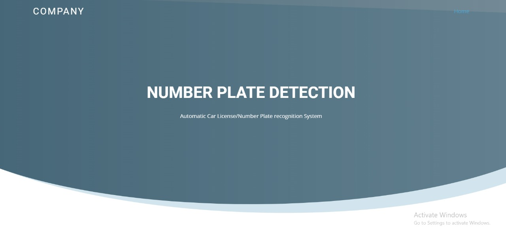

# Car_No_Plate_Detection

This Car No Plate Detection App is designed to execute a physical identification of the car by displaying the it's details along with owner's details. Here user needs to upload the image of the car only. 

It has mainly two parts:

1 - the numbers identification server (hereinafter – AWS)

2 - WEBAPP

To start a local Server simply run this command in the system
* python -m http.server 8000

 The system is linked to an AWS service that is "Textract" for detecting the no. plate text.

## Amazon Textract
 Amazon Textract is a service that automatically detects and extracts text and data from scanned documents. It goes beyond simple optical character recognition (OCR) to also identify the contents of fields in forms and information stored in tables
 
Here are Some Preview Images of App.

